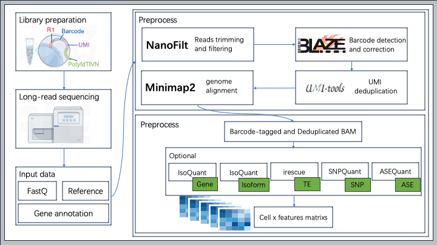

# NanoQuant

A Nextflow-based pipeline for comprehensive expression quantification from single-cell Nanopore sequencing data. The pipeline supports multi-level quantification including gene expression, transcript isoforms, SNP detection, allele-specific expression (ASE), and transposable element (TE) expression.

## Introduction

This pipeline performs end-to-end processing of single-cell Nanopore sequencing data and generates multiple expression quantification matrices together with quality control reports and visualization summaries.

The workflow integrates alignment, variant detection, and expression quantification tools into a unified reproducible pipeline built using **Nextflow** and **Docker**.

<p align="center">

</p>

## Key Features

- End-to-end processing for single-cell Nanopore RNA sequencing
- Multi-level expression quantification:
  - Gene expression
  - Transcript isoform expression
  - SNP
  - Allele-specific expression (ASE)
  - Transposable element (TE) expression
- Automated quality control and visualization reports
- Fully reproducible workflow using **Nextflow + Docker**
- Scalable execution on HPC environments

## Requirements

Before running the pipeline, ensure the following software is installed:

- **Nextflow** (≥24.04.2)
- **Docker**

### Installing Nextflow

```bash
# Install using curl
curl -s https://get.nextflow.io | bash

# Or install using conda
conda install -c bioconda nextflow
```

### Installing Docker

Please refer to the [Docker official documentation](https://docs.docker.com/get-docker/) for installation instructions.

## Quick Start

### 1. Prepare Samplesheet (samplesheet.csv)

Create a CSV format samplesheet with the following columns:

```csv
sample,fastq,cell_count
SAMPLE1,/path/to/sample1.fastq.gz,5000
SAMPLE2,/path/to/sample2.fastq.gz,3000
```

- `sample`: Sample name
- `fastq`: Path to FASTQ file
- `cell_count`: Expected number of cells

Reference example file: `example/samplesheet.csv`

### 2. Configure Parameters (params.yml)

Create a parameter configuration file specifying genome references and analysis parameters:

```yaml
# Basic information
email: "your_email@example.com"
multiqc_title: "My_scRNA_Analysis"

# Input file
input: "./samplesheet.csv"

# Genome references
genome_fasta: "/path/to/genome.fa"
gtf: "/path/to/annotation.gtf"

# Analysis parameters
skip_trimming: false
min_length: 500
split_amount: 500000

# Quantification tool
quantifier: "isoquant"

# Barcode format
barcode_format: "10X_5v2"
```

Reference example file: `example/params.yml`

### 3. Configure Resources (custom.conf)

Optional: Create a custom configuration file to adjust computational resources:

```groovy
process {
    executor = 'local'
    memory = '1024.GB'
    cpus = 60
    time = 150.h
}
```

Reference example file: `example/custom.conf`

### 4. Run Pipeline

Use the provided example script to run the pipeline:

```bash
# Reference: example/run_scnanoseq.sh
nextflow run /path/to/NanoQuant \
  --input ./samplesheet.csv \
  --outdir ./results \
  -params-file ./params.yml \
  -c ./custom.conf \
  -profile docker
```

**Parameter descriptions:**
- `--input`: Path to samplesheet
- `--outdir`: Output directory
- `-params-file`: Parameter configuration file
- `-c`: Custom configuration file
- `-profile`: Use docker or singularity

## Main Features

1. Raw read quality control (FastQC, NanoPlot, ToulligQC)  
2. Read filtering and trimming (NanoFilt)  
3. Barcode detection and correction (BLAZE)  
4. Genome and transcriptome alignment (minimap2)  
5. UMI deduplication (UMI-tools)  
6. Gene and transcript expression quantification (IsoQuant)  
7. SNP detection and SNP-level expression matrix generation  
8. Allele-specific expression (ASE) quantification  
9. Transposable element (TE) expression quantification (IRescue)  
10. Single-cell quality control and visualization (Seurat)  
11. Integrated quality control report (MultiQC)

## Pipeline Output

The pipeline produces feature-barcode matrices as the main output, which can be directly used by downstream analysis tools (e.g., Seurat). It also generates various quality control metrics and reports.


## Main Output Files

- Gene expression matrices
  ` {SAMPLENAME}/genome/isoquant/output/{SAMPLENAME}.chr*/{SAMPLENAME}.chr*/*gene_grouped_counts* `

- Transcript expression matrices
  ` {SAMPLENAME}/genome/isoquant/output/{SAMPLENAME}.chr*/{SAMPLENAME}.chr*/*transcript_grouped_counts* `

- SNP expression matrices  
  ` snp/matrix`

- ASE expression matrices  
  ` ase/matrix`

- TE expression matrices  
  ` irescue/irescue_out/counts`


## Citation

If you use this pipeline, please cite:

> **scnanoseq: an nf-core pipeline for Oxford Nanopore single-cell RNA-sequencing**
>
> Austyn Trull, nf-core community, Elizabeth A. Worthey, Lara Ianov
>
> bioRxiv 2025.04.08.647887; doi: https://doi.org/10.1101/2025.04.08.647887

## License

This project is developed based on nf-core/scnanoseq.
